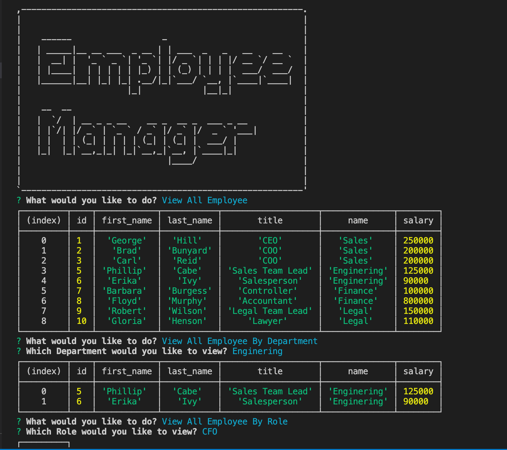
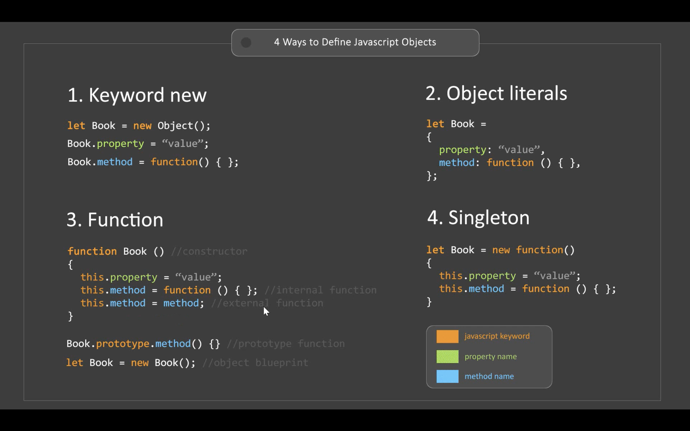

# Employee-Tracker
## Description
 This is a Employee Tracker Application, it allows you to view, remove, and update employee files as you desire.

## Screenshots

## User Story
    As a business owner
    I want to be able to view and manage the departments, roles, and employees in my company
    So that I can organize and plan my business

## Installation
Caution: This application is only operating on Terminal, not in browser.

### Step 1: Node Installation
Make sure download node.js before running the application. If you are not sure, type in "node -v" at the command line in Terminal.

### Step 2: Dependencies Installation
Make sure before download dependencies, go in to the local repository folder in terminal, then type in "npm i" at the command line, then let terminal do the job.  

## Usage
Invoke app.js in Terminal, answer the prompted questions. Detailed instructions will be included in the demo video.

## Demostration
https://drive.google.com/file/d/1yjswhc-eWr1oFPhERppCg2bVs_x3m9im/view
